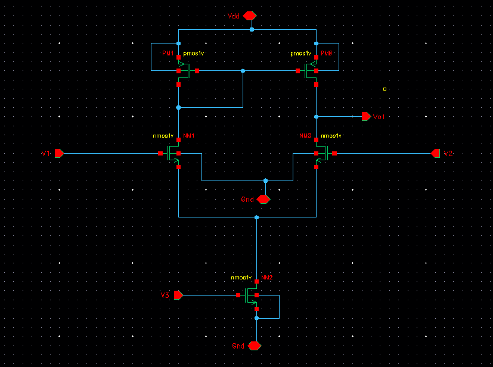
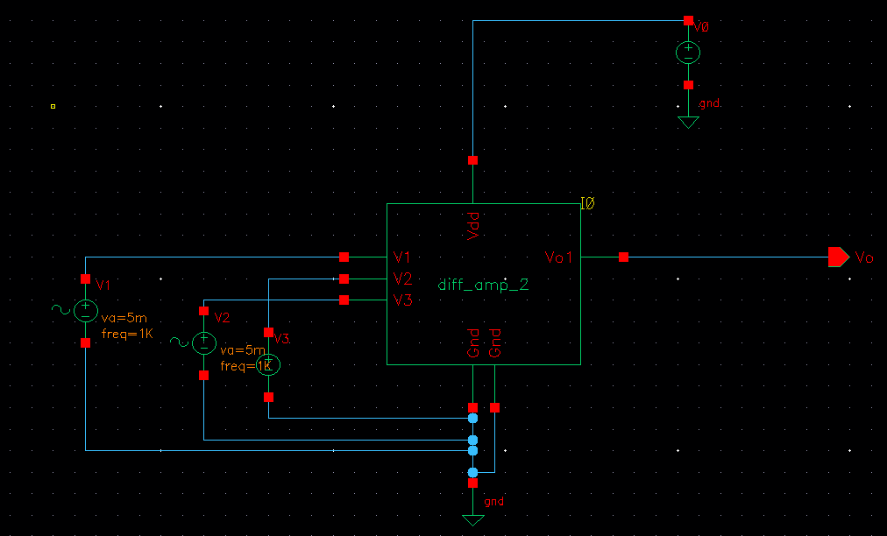
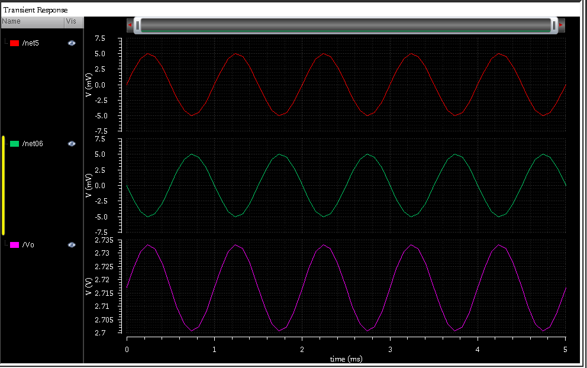
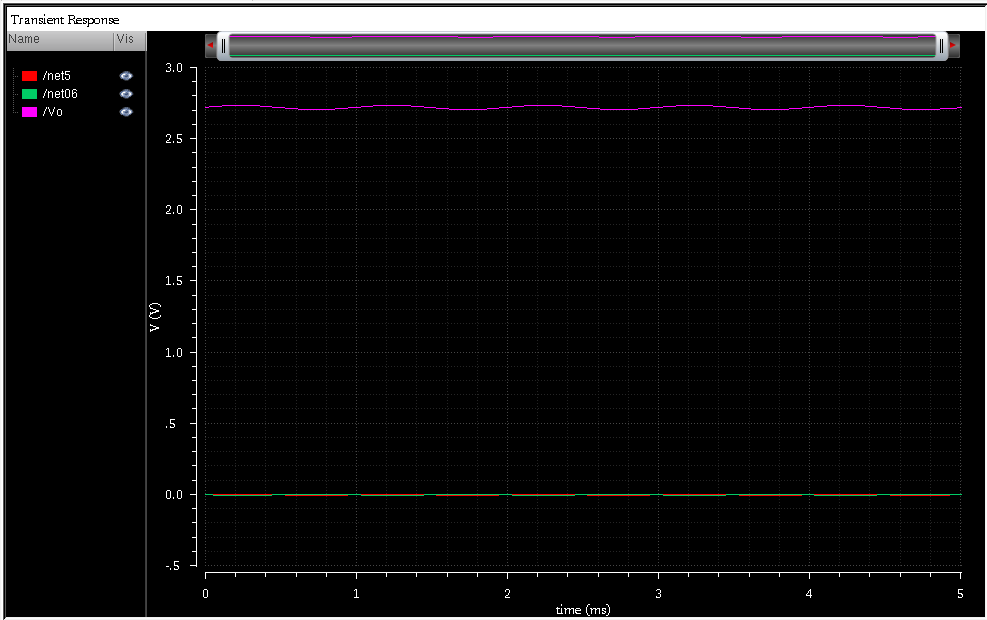
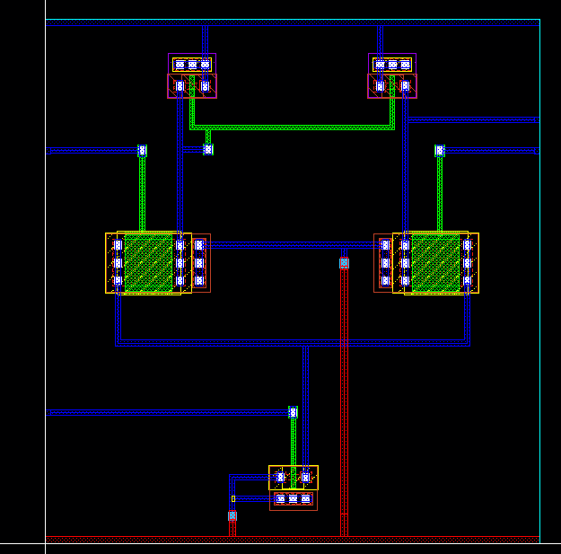
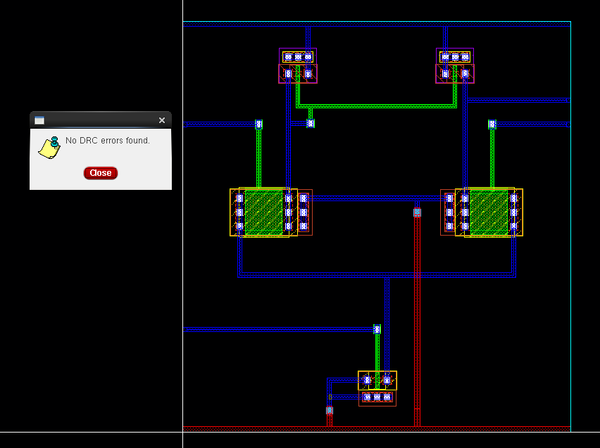
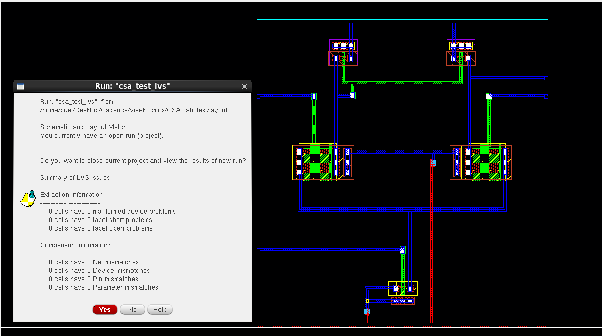

# CMOS Differential Amplifier — Custom Analog IC Design

A transistor-level CMOS differential amplifier designed and physically
implemented using Cadence Virtuoso. The project covers the complete
custom analog IC design flow from schematic design and transistor-level
simulation to layout, DRC, and LVS verification.

---

## Overview

The circuit is a single-stage CMOS differential amplifier consisting of:

- NMOS differential input pair
- PMOS active load / current-mirror configuration
- NMOS tail current source
- Single-ended output
- Differential input terminals
- Bias current control
- VDD and GND supply rails

The design was developed at transistor level and subsequently
implemented as a custom IC layout.

### Design Flow

```text
        Transistor-Level Schematic
                    │
                    ▼
              Symbol Creation
                    │
                    ▼
                Testbench
                    │
                    ▼
          Spectre Transient Analysis
                    │
                    ▼
              Custom Layout
                    │
              ┌─────┴─────┐
              ▼           ▼
             DRC         LVS
              │           │
              └─────┬─────┘
                    ▼
          Layout-Verified Design
````

---

# 1. Circuit Architecture

The differential amplifier uses a conventional CMOS differential
topology.

### Input Stage

The NMOS transistors `NM1` and `NM0` form the differential input pair.

```text
                 VDD
                  │
             ┌────┴────┐
            PM1      PM0
             │        │
             │        ├────── Vout
             │        │
            NM1      NM0
             │        │
             └────┬───┘
                  │
                 NM2
                  │
                 GND
```

The differential input pair converts the input voltage difference
between `V1` and `V2` into differential drain currents.

The PMOS load provides active loading and converts the differential
current into a single-ended output at `Vo`.

`NM2` operates as the tail current source and provides the bias current
for the differential pair.

---

# 2. Transistor-Level Schematic

The complete transistor-level schematic was created in Cadence
Virtuoso.



### Main circuit elements

| Device | Function                      |
| ------ | ----------------------------- |
| NM1    | Differential input transistor |
| NM0    | Differential input transistor |
| PM1    | PMOS active load              |
| PM0    | PMOS active load              |
| NM2    | Tail current source           |
| V1     | Differential input            |
| V2     | Differential input            |
| V3     | Tail-current bias             |
| Vo     | Single-ended output           |

---

# 3. Testbench

A separate testbench was created using the generated amplifier symbol.

The testbench provides:

* VDD supply
* Ground reference
* Differential input signals
* Tail-current bias signal
* Output observation node

The input sources are configured with sinusoidal excitation for
transient analysis.



---

# 4. Transient Simulation

Transient analysis was performed using Cadence Spectre to verify the
time-domain response of the differential amplifier.

The differential input signals are applied with opposite phase, and
the resulting single-ended output is observed at `Vo`.

### Output Response

The output waveform shows a periodic response corresponding to the
applied differential input excitation.





The simulation confirms functional differential amplification and
demonstrates the expected time-domain response of the transistor-level
circuit.

---

# 5. Custom Layout

After schematic-level verification, the circuit was implemented using
custom layout in Cadence Virtuoso.

The layout contains the physical implementation of:

* NMOS differential pair
* PMOS active load
* Tail current source
* Metal interconnects
* Power and ground connections
* Input/output connections



The layout was subsequently subjected to physical verification.

---

# 6. Design Rule Check (DRC)

DRC was performed to verify that the physical layout satisfies the
technology design rules.

### DRC Result

**No DRC errors found.**



The clean DRC result confirms that the implemented geometry satisfies
the applicable layout design rules.

---

# 7. Layout Versus Schematic (LVS)

LVS verification was performed to compare the extracted layout
connectivity and devices against the original schematic.

### LVS Result

**Schematic and Layout Match**

The LVS report shows:

```text
Net mismatches       : 0
Device mismatches    : 0
Pin mismatches       : 0
Parameter mismatches : 0
```



The successful LVS result verifies correspondence between the
transistor-level schematic and the physical layout.

---

# 8. Technology and Tools

| Parameter          | Details                        |
| ------------------ | ------------------------------ |
| Design Type        | CMOS Analog IC                 |
| Circuit            | Differential Amplifier         |
| Technology         | GPDK90                         |
| Design Environment | Cadence Virtuoso               |
| Simulator          | Cadence Spectre                |
| Layout             | Custom Transistor-Level Layout |
| Verification       | DRC + LVS                      |
| Platform           | Linux                          |

---

# 9. Key Concepts Demonstrated

### Circuit Design

* CMOS differential pair
* Active PMOS load
* Current-source biasing
* Differential-to-single-ended conversion
* Small-signal transistor operation

### Analog Simulation

* Transient analysis
* Differential input excitation
* Time-domain waveform analysis
* Output response characterization

### Physical Design

* Custom transistor layout
* Device placement
* Metal interconnect routing
* Power and ground routing
* Layout verification

### Physical Verification

* Design Rule Check (DRC)
* Layout Versus Schematic (LVS)
* Device matching verification
* Net connectivity verification
* Pin verification
* Parameter verification

---

# 10. Complete Design Flow

```text
        CMOS DEVICE-LEVEL DESIGN
                    │
                    ▼
        Differential Amplifier
               Schematic
                    │
                    ▼
           Symbol Generation
                    │
                    ▼
              Testbench
                    │
                    ▼
        Spectre Transient Analysis
                    │
                    ▼
          Functional Verification
                    │
                    ▼
          Custom Transistor Layout
                    │
             ┌──────┴──────┐
             ▼             ▼
            DRC           LVS
             │             │
             │             │
             └──────┬──────┘
                    ▼
        Layout-Verified Analog IC
```

---

# 11. Project Outcome

This project demonstrates the implementation of a complete
transistor-level CMOS analog circuit from schematic through physical
layout and verification.

The final design achieved:

* Functional transient simulation
* Custom transistor-level layout
* Clean DRC verification
* Successful LVS verification
* Schematic-to-layout correspondence

---

## Tools

`Cadence Virtuoso` `Spectre` `GPDK90` `DRC` `LVS` `Custom Layout`

## Author

**Vivek Raju Kosigi**

VLSI | ASIC | Analog IC Design


